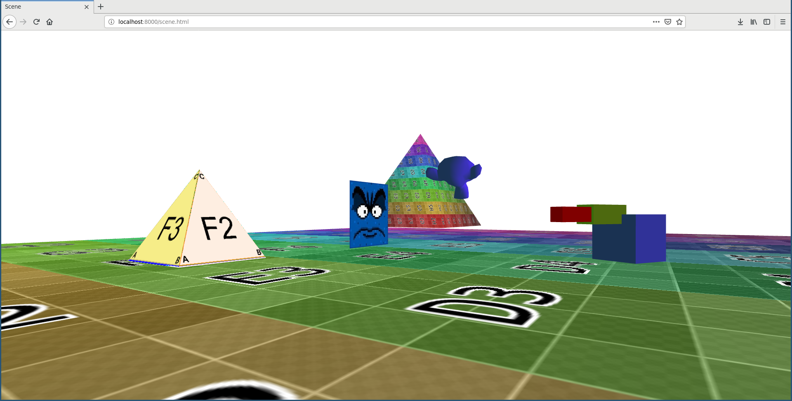

# Simple FPS Rendering Engine

## About

The intention of this project is to learn about the intersection of 3 different
topics; graphics, web, and functional programming. It uses Elm with WebGL to
create a basic 3D first-person scene implementing several lower level graphics
techniques including matrix transformations to model parent/child local
transforms, texture mapping, and basic lighting with shaders.

## Update 2023

It seems like one of the dependencies for this project, `Zinggi/elm-obj-loader`,
is getting a 404. Therefore this dependency will be included in version control,
so as long as you have Elm 0.18.0 tooling, you should be able to just run `elm
init`.

## Building

This project is Elm 0.18.0, so you need to have that version installed.

To install the binaries manually, use 
- [Install Binaries](https://sirfitz.medium.com/install-elm-0-18-0-in-2021-3f64ce298801)
If you want to use `npm`, you can follow this;
- [Install with npm](https://discourse.elm-lang.org/t/downgrade-to-v18/2005/2)

Note that for the `npm`, you will likely need an older version of Node.js, so it
is recommended to use the [Node Version Manager
`npm`](https://github.com/nvm-sh/nvm) for that.

## Running

In order to be able to load the textures and models, the website most be served
by an HTTP server because of browser security, see
[SOP](https://developer.mozilla.org/en-US/docs/Web/Security/Same-origin_policy)
and [CORS](https://developer.mozilla.org/en-US/docs/Glossary/CORS) if curious.

If you have Python 3 installed, simply run `python3 -m http.server`

Then open up Either open up `Scene.html`, or use the command `elm-reactor`, if you want to be
able to modify the source file and compile;

You can walk around the scene with simple FPS controls. Open `scene.html` with
an HTTP server, you can use the following;

## Controls

- Look Around: `Mouse`

- FPS Movement: `WASD`

- Robot Movement: `◀ ▼ ▲ ▶`

- Rotate Robot: `N and M`

- Rotate Robot Arm: `Y and H`

- Rotate Robot Hand: `U and J`

